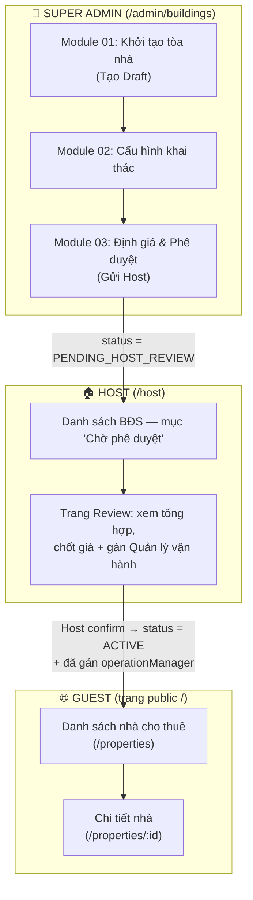

# Luồng đi hệ thống — Onboarding tòa nhà: Admin → Host → Guest

Tài liệu mô tả luồng nghiệp vụ chính của hệ thống: Super Admin onboarding tòa nhà qua **3 module**, sau đó **Host phê duyệt & gán quản lý**, cuối cùng **Guest (khách thuê) xem được nhà** trên trang public.

## Sơ đồ tổng quan



## Vòng đời trạng thái (PropertyStatus)

```
DRAFT ──(cấu hình + có cải tạo)──> UNDER_RENOVATION ──(hoàn tất cải tạo)──┐
  │                                                                       │
  └──(không cải tạo, submit-to-host)──> PENDING_HOST_REVIEW <─────────────┘
                                              │
                                   (Host confirm + gán manager)
                                              │
                                              ▼
                                           ACTIVE  ──(disable)──> DISABLED
```

| Trạng thái | Ý nghĩa | Ai thao tác tiếp |
|---|---|---|
| `DRAFT` | Nháp — đang onboarding ở phía Admin | Super Admin |
| `UNDER_RENOVATION` | Đang cải tạo theo kế hoạch | Super Admin (hoàn tất cải tạo) |
| `PENDING_HOST_REVIEW` | Đã gửi Host, chờ phê duyệt | Host |
| `ACTIVE` | Đang kinh doanh — Guest nhìn thấy | Host / Manager vận hành |
| `DISABLED` | Đã vô hiệu hóa | — |

---

## GIAI ĐOẠN 1 — Super Admin: 3 module onboarding

Vào từ trang landing **Nhà thuê Admin** (`/admin/buildings` — `NhaThueLanding.tsx`), gồm 3 module làm lần lượt:

### Module 01 — Khởi tạo tòa nhà (Tạo Draft)

- **Route:** `/admin/buildings/draft` — file `TaoDraftPage.tsx`
- **Việc làm:**
  1. Nhập thông tin cơ bản: tên tòa nhà, địa chỉ, khu vực (zone cha → zone con), diện tích, số tầng, số phòng/tầng, mô tả, upload ảnh (Cloudinary).
     - API: `POST /api/v1/properties/draft` → tạo property với status `DRAFT`.
  2. Khai báo **thiết bị bàn giao có sẵn** (equipment manifest): danh mục thiết bị, số lượng, tình trạng (NEW/GOOD).
     - API: `PUT /api/v1/properties/{id}/equipment-manifest`
  3. Nhập **hợp đồng đầu vào** (inbound contract) với chủ nhà gốc: thời hạn, giá thuê đầu vào, file PDF.
     - API: `POST /api/v1/properties/{id}/inbound-contract`
- **Kết quả:** Tòa nhà ở trạng thái `DRAFT`, sẵn sàng cho Module 02.

### Module 02 — Cấu hình khai thác

- **Route:** `/admin/buildings/configuration` (chọn tòa nhà từ danh sách) — file `CauHinhKhaiThacPage.tsx`, dùng `StepOnboardingOptions.tsx`
- **Việc làm:**
  1. **Chọn loại hình kinh doanh:** cho thuê **nguyên căn** (`wholeHouse = true`) hay **theo phòng**, và có **cải tạo** hay không.
     - API: `POST /api/v1/properties/{id}/onboarding-options`
  2. (Nếu có cải tạo) Khai báo **hạng mục cải tạo** (chi phí từng dòng) + **lịch cải tạo** (ngày bắt đầu/kết thúc).
     - API: `POST .../renovation-lines`, `PUT .../renovation-schedule`
  3. (Tuỳ chọn) **Cập nhật cấu trúc** tòa nhà: số tầng, số phòng/tầng.
     - API: `PUT .../structure`
  4. (Tuỳ chọn) **Mua thiết bị mới** bổ sung ngoài thiết bị bàn giao.
  5. (Nếu thuê theo phòng) **Chia phòng:** tạo từng phòng (số phòng, diện tích, số người tối đa).
     - API: `POST .../rooms`
  6. **Phân bổ thiết bị** vào từng phòng / khu vực trong nhà (phòng khách, bếp...).
     - API: `POST .../equipments/assign`
- **Kết quả:** Tòa nhà đã cấu hình đầy đủ, sẵn sàng định giá.

### Module 03 — Định giá & Phê duyệt (Gửi Host)

- **Route:** `/admin/buildings/pricing-approval` — file `DinhGiaPheDuyetPage.tsx`, dùng `StepSubmitToHost.tsx`
- **Việc làm:**
  1. **Tính giá đề xuất theo khấu hao:** hệ thống tính giá thuê tối thiểu dựa trên chi phí đầu vào + khấu hao thiết bị + chi phí cải tạo.
     - API: `POST /api/v1/properties/{id}/depreciation/calculate`
  2. **Gửi Host phê duyệt.**
     - API: `POST /api/v1/properties/{id}/submit-to-host`
- **Kết quả:**
  - Không có cải tạo → status chuyển thẳng sang **`PENDING_HOST_REVIEW`**.
  - Có cải tạo → status `UNDER_RENOVATION`; khi xong gọi `POST .../renovation/complete` rồi mới sang `PENDING_HOST_REVIEW`.

---

## GIAI ĐOẠN 2 — Host: Phê duyệt & gán Quản lý vận hành

### Bước 1 — Thấy nhà chờ duyệt

- **Route:** `/host/properties` — file `PropertyList.tsx`
- Danh sách BĐS tách riêng mục **"Chờ phê duyệt"** (lọc `status === 'PENDING_HOST_REVIEW'`). Click vào → đi tới trang review.

### Bước 2 — Review & xác nhận

- **Route:** `/host/review/:id` — file `HostPropertyReview.tsx`
- Host xem **tổng hợp onboarding** (`GET .../onboarding-summary`): thông tin tòa nhà, hợp đồng đầu vào, thiết bị, cải tạo, **giá đề xuất tối thiểu** từ hệ thống.
- Host nhập:
  - **Tỷ lệ dự phòng** (`contingencyPercent`, mặc định 110%, tối thiểu 100%) → giá chốt = giá đề xuất × tỷ lệ; hoặc nhập **giá thủ công**.
  - Nếu thuê theo phòng → chốt **giá từng phòng**.
  - Chọn **Quản lý vận hành** (`operationManagerId`) từ danh sách managers (`GET /api/v1/user/managers`).
- Bấm xác nhận:
  - API: `POST /api/v1/properties/{id}/host-confirm`
- **Kết quả:** status chuyển sang **`ACTIVE`** + tòa nhà đã có operation manager.

> Ngoài ra Host có thể gán/đổi manager từ trang chi tiết BĐS (`/host/properties/:id` — `PropertyDetail.tsx`, API `PATCH .../operation-manager`).

---

## GIAI ĐOẠN 3 — Guest: Xem nhà trên trang public

- **Routes:** `/` (HomePage) → `/properties` (PropertyListPage) → `/properties/:id` (PropertyDetailPage)
- Dữ liệu lấy từ API thật qua `propertyService.ts` (bản public), **chỉ hiển thị** nhà thỏa **cả 2 điều kiện**:

  ```
  status === 'ACTIVE'  &&  operationManagerId != null
  ```

- Guest xem được danh sách nhà đang kinh doanh, vào chi tiết xem thông tin, ảnh, giá... và liên hệ thuê (`/contact`).

---

## Tóm tắt 1 dòng

> **Admin tạo Draft → cấu hình khai thác → định giá & gửi Host** (`DRAFT` → `PENDING_HOST_REVIEW`) → **Host chốt giá + gán Quản lý vận hành** (→ `ACTIVE`) → **Guest thấy nhà trên trang public** (chỉ nhà `ACTIVE` đã có manager).

## File liên quan chính

| Giai đoạn | File |
|---|---|
| Routes toàn app | `frontend-web/src/App.tsx` |
| Landing 3 module | `frontend-web/src/pages/super-admin/nha-thue/NhaThueLanding.tsx` |
| Module 01 | `frontend-web/src/pages/super-admin/nha-thue/TaoDraftPage.tsx` + `wizard/StepPropertyInfo.tsx` |
| Module 02 | `frontend-web/src/pages/super-admin/nha-thue/CauHinhKhaiThacPage.tsx` + `wizard/StepOnboardingOptions.tsx` |
| Module 03 | `frontend-web/src/pages/super-admin/nha-thue/DinhGiaPheDuyetPage.tsx` + `wizard/StepSubmitToHost.tsx` |
| Host duyệt | `frontend-web/src/pages/properties/PropertyList.tsx`, `frontend-web/src/pages/host/HostPropertyReview.tsx` |
| Guest xem nhà | `frontend-web/src/pages/public/PropertyListPage.tsx`, `PropertyDetailPage.tsx`, `frontend-web/src/services/propertyService.ts` |
| API service | `frontend-web/src/services/property.service.ts` |
| Enum trạng thái | `frontend-web/src/types/api.types.ts` |
